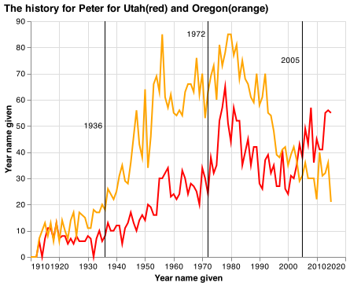
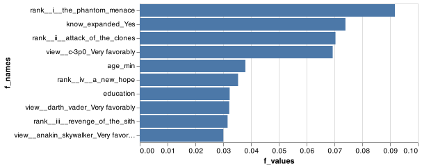

### CSE 250 Coding Challenge

__Bridger Hackworth__

### Challenge Summary

_I think that I did well. I just took to long on the first question and then ran out of time to figure out how to porperly place the data from question 2 into a candlestick chart._

#### Challenge 1

##### Answer




##### Code

```python
 
gh_path = "https://github.com/byuidatascience/data4names/raw/master/data-raw"
url_names = gh_path + "/names_year/names_year.csv"
dat_names = pd.read_csv(url_names)

peter_names = dat_names.query("name == 'Peter'")
ut_peter = peter_names.filter(['year','UT'])
or_peter = peter_names.filter(['year','OR'])


utah = alt.Chart(ut_peter).encode(
        alt.X(
            'year',
            axis=alt.Axis(
                format='.4',
                title="Year name given"),
        ), 
        alt.Y(
            'UT',
            axis=alt.Axis(
                format='.4',
                title="Year name given")
    ),
    color=alt.value('red')
    ).properties(
    title='The history for Peter for Utah(red) and Oregon(orange)'
    ).mark_line()

oregon = alt.Chart(or_peter).encode(
        alt.X(
            'year',
            axis=alt.Axis(
                format='.4',
                title="Year name given"),
        ), 
        alt.Y(
            'OR',
            axis=alt.Axis(
                format='.4',
                title="Year name given")
        ),
    color=alt.value('orange')
    ).properties(
    title='The history for Peter for Utah(red) and Oregon(orange)'
    ).mark_line()

marks = pd.DataFrame({'year': [1936, 1972, 2005], 'annotations':['1936','1972', '2005'], 'pos': [50, 85, 75]})

chart2 = alt.Chart(marks).mark_rule().encode(
    alt.X('year')
)

annotation = alt.Chart(marks).mark_text(
    align='right',
    fontSize = 10,
    dx = -3
).encode(
    x='year',
    y='pos',
    text='annotations'
)


chart3 = utah + oregon + chart2 + annotation
chart3 = chart3.configure_title(anchor='start')
chart3
chart3.save('q1.png')

```

### Challenge 2

#### Code
```python
ages = pd.Series(["10-25", "10-25", "26-35", "56-85", "0-9", "46-55",
    "56-85", "0-9", "26-35", "56-85", "0-9", "10-25"])

df = ages.str.split("-", expand = True).rename({0:"young", 1:"old"}, axis = 1)

alt.Chart(df).mark_boxplot(extent='min-max').encode(
    x='young:O'
)
```

### Challenge 3

#### Answer
The mean of the series is 59.83.

#### Code

```python
mister = pd.Series(["lost", 15, 22, 45, 31, "lost", 85, 38, 129, 80, 21, 2])

mister = mister.replace('lost', 125)

mister.mean().round(2)
```

### Challenge 4

#### Answer

The model is about 60.73% accurate.



#### Code
```python
from sklearn.model_selection import train_test_split
from sklearn import tree
from sklearn.naive_bayes import GaussianNB
from sklearn.ensemble import GradientBoostingClassifier
from sklearn import metrics
from sklearn.metrics import accuracy_score
#%%

url = "http://byuistats.github.io/CSE250-Course/data/clean_starwars.csv"
dat = pd.read_csv(url)

X = dat.drop(columns='gender')
y = dat.gender

X_train, X_test, y_train, y_test = train_test_split(
    X, 
    y, 
    test_size = .20, 
    random_state = 2020)

clf = GradientBoostingClassifier(random_state = 2020)
clf = clf.fit(X_train, y_train)
y_pred = clf.predict(X_test)

score = accuracy_score(y_test,y_pred)

df_features = pd.DataFrame(
    {'f_names': X_train.columns, 
    'f_values': clf.feature_importances_}).sort_values('f_values', ascending = False)

f_chart = alt.Chart(df_features.query("f_values > .025")).encode(alt.X('f_values'), alt.Y('f_names', sort = "-x")).mark_bar()
```