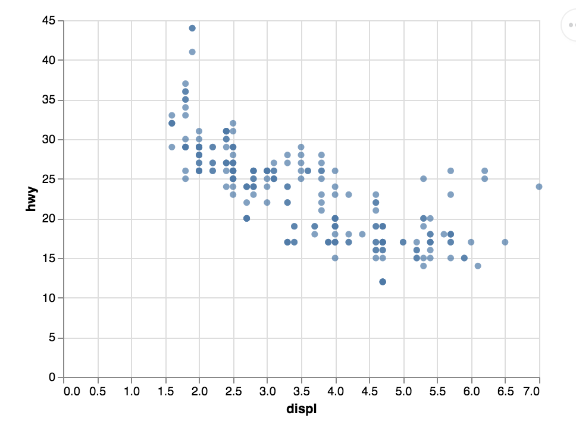

# Client Report - [Project0]
__Course CSE 250__
Bridger Hackworth

## Elevator pitch

This project was to verify that everything on our computer was installed and running smoothly. It also allowed us to get familiar with the tools that we will use to code for data science. 

### GRAND QUESTIONS
#### 1. Finish the readings and come to class prepared with any questions to get your environment working smoothly.                
#### 2. Create a python script and use VS Code to create the example Altair chart in the assigned readings (note that you have to type chart to see the Altair chart after you run the code). Save your Altair chart for submission. 
#### 3.Include the Markdown table created from the following code in your report (assuming you have mpg from question 2).


The code is shown below with the charts and tables that were created.

##### TECHNICAL DETAILS

```python 
url = "https://github.com/byuidatascience/data4python4ds/raw/master/data-raw/mpg/mpg.csv"
mpg = pd.read_csv(url)

chart = (alt.Chart(mpg)
  .encode(
    x='displ', 
    y='hwy')
  .mark_circle()
)
```

_insert your chart png here_


```python 
print(mpg
    .head(5)
    .filter(["manufacturer", "model","year", "hwy"])
    .to_markdown(index=False))

```
_replace the table below with your table_
| manufacturer   | model   |   year |   hwy |
|:---------------|:--------|-------:|------:|
| audi           | a4      |   1999 |    29 |
| audi           | a4      |   1999 |    29 |
| audi           | a4      |   2008 |    31 |
| audi           | a4      |   2008 |    30 |
| audi           | a4      |   1999 |    26 |


## APPENDIX A (PYTHON CODE)
```python
#%%
import pandas as pd   
import altair as alt  
from altair_saver import save as s

#%%
url = "https://github.com/byuidatascience/data4python4ds/raw/master/data-raw/mpg/mpg.csv"
mpg = pd.read_csv(url)

chart = (alt.Chart(mpg)
  .encode(
    x='displ', 
    y='hwy')
  .mark_circle()
)

chart
#%%
s(chart, 'test.png')

# %%


print(mpg
    .head(5)
    .filter(["manufacturer", "model","year", "hwy"])
    .to_markdown(index=False))
# %%
```