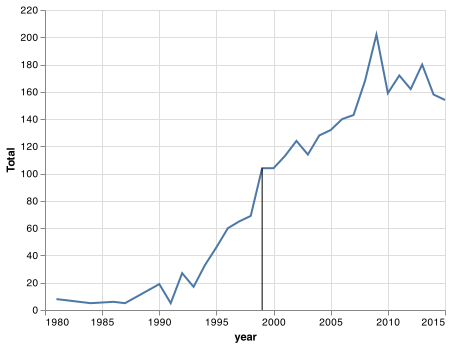
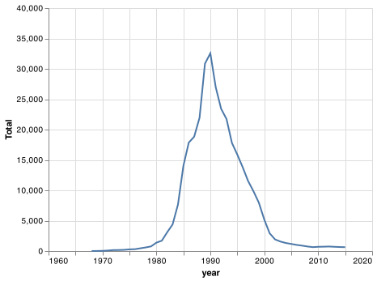
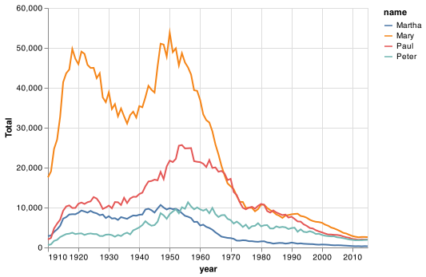
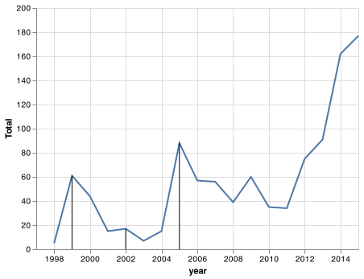

# Client Report - [Project 1]
__Course CSE 250__
__Bridger Hackworth__

## Elevator pitch

Given the data of all first given names in the United States from 1910 to 2015, we are able to build graphs that demonstrate interesting trends. 

### GRAND QUESTION 1
#### How does your name at your birth year compare to its use historically?

###### It seems like overall my name has continued to grow in popularity since it was first listed in the directory. 1999, the year I was born, seemed to be the beginning of short plateu before it continued on it's upward growth. My birth-year seems to fall right in the middle of the uphill climb. 

##### TECHNICAL DETAILS


` `
- The line highlights my birth year



Code:
```bridger_names = us_names.query("name == 'Bridger'")

chart1 = (alt.Chart(bridger_names)
    .encode(
        alt.X(
            'year', 
            axis=alt.Axis(format='.4'),
            scale = alt.Scale(domain = (1980, 2015))
        ), 
        alt.Y('Total', scale = alt.Scale(domain = (0, 220))),
    )
    .mark_line()
)

birthday = bridger_names.query("year == 1999")


brithday_chart = (alt.Chart(birthday)
    .encode(
        alt.X(
            'year', 
            axis=alt.Axis(format='.4'),
            scale = alt.Scale(domain = (1980, 2015))
        ), 
        alt.Y('Total', scale = alt.Scale(domain = (0, 220))),
    )
    .mark_rule())

chart1 = chart1 + brithday_chart
chart1.save('birthday_chart.png')
```

### GRAND QUESTION 2
#### If you talked to someone named Brittany on the phone, what is your guess of their age? What ages would you not guess?

###### It looks like the name Brittany was at it's peak popularity in 1990. Given this information, in the year 2022 it is a safe to guess that somone by the name of Brittany would most likley be 32 years old. The name's popularity really did not take off until a little after 1980 and it really died down a little after 2000. So I would not guess younger than 20 or older than 40. 

##### TECHNICAL DETAILS


` `



Code:
```brittany_names = us_names.query("name == 'Brittany'")

chart2 = (alt.Chart(brittany_names)
    .encode(
      alt.X(
        'year', 
        axis=alt.Axis(format='.4'),
        scale = alt.Scale(domain = (1960, 2020))
      ), 
      alt.Y(
          'Total',
          scale = alt.Scale(domain = (0, 40000))
        ),
    )
    .mark_line()
)

chart2
chart2.save('brittany_names.png')
```

### GRAND QUESTION 3
#### Mary, Martha, Peter, and Paul are all Christian names. From 1920 - 2000, compare the name usage of each of the four names.

###### While Mary is largely the most popular name of the 4, their growth seems to all be connected. 1955 seems to be about the year that they all collectively began to decline. 

##### TECHNICAL DETAILS


` `



Code:
```
mary_names = us_names.query("name == 'Mary' | name == 'Peter' | name == 'Martha' | name == 'Paul'")

chart4 = (alt.Chart(mary_names)
    .encode(
      alt.X(
          'year', 
          axis=alt.Axis(format='.4'),
          scale = alt.Scale(domain = (1910, 2015))
        ), 
      alt.Y('Total', scale = alt.Scale(domain = (0, 60000))),
      color = 'name'
     )
    .mark_line()
)

chart4
chart4.save('christian_names.png')
```
### GRAND QUESTION 4
#### Think of a unique name from a famous movie. Plot that name and see how increases line up with the movie release.

###### When choosing the name "Anakin", from the popular Star Wars movie series, we can see that the amount of people receiving the name is directly correlated to the movie release dates of "Star Wars Episode 1: The Phantom Menace" in 1999, "Star Wars Episode 2: Attack of the Clones" in 2002, and "Star Wars Episode 3: Revenge of the Sith", in 2005. 

##### TECHNICAL DETAILS

- The red lines display the years that each star wars film was released.

` `



Code:
```anakin_names = us_names.query("name == 'Anakin'")

chart3 = (alt.Chart(anakin_names)
    .encode(
      alt.X('year', 
      axis=alt.Axis(format='.4'),
      scale = alt.Scale(domain = (1997, 2015))
    ), 
      alt.Y('Total', scale = alt.Scale(domain = (0, 200))),
     )
    .mark_line()
)

release_dates = anakin_names.query("year == 1999 | year == 2002 | year == 2005")

release_chart = (alt.Chart(release_dates)
    .encode(
      alt.X('year', 
      axis=alt.Axis(format='.4'),
      scale = alt.Scale(domain = (1997, 2015))
    ), 
      alt.Y('Total', scale = alt.Scale(domain = (0, 200))),
     )
    .mark_rule()
)

chart3 = chart3 + release_chart
chart3.save('anakin_names.png')

```


## APPENDIX A (PYTHON SCRIPT)


```#%%
import pandas as pd   
import altair as alt   

#%%
url = "https://raw.githubusercontent.com/byuidatascience/data4names/master/data-raw/names_year/names_year.csv"
us_names = pd.read_csv(url)

#%%
us_names
us_names.query('year == 1910')
#%%
bridger_names = us_names.query("name == 'Bridger'")

chart1 = (alt.Chart(bridger_names)
    .encode(
        alt.X(
            'year', 
            axis=alt.Axis(format='.4'),
            scale = alt.Scale(domain = (1980, 2015))
        ), 
        alt.Y('Total', scale = alt.Scale(domain = (0, 220))),
    )
    .mark_line()
)

birthday = bridger_names.query("year == 1999")


brithday_chart = (alt.Chart(birthday)
    .encode(
        alt.X(
            'year', 
            axis=alt.Axis(format='.4'),
            scale = alt.Scale(domain = (1980, 2015))
        ), 
        alt.Y('Total', scale = alt.Scale(domain = (0, 220))),
    )
    .mark_rule())

chart1 = chart1 + brithday_chart
chart1.save('birthday_chart.png')

# %%
brittany_names = us_names.query("name == 'Brittany'")

chart2 = (alt.Chart(brittany_names)
    .encode(
      alt.X(
        'year', 
        axis=alt.Axis(format='.4'),
        scale = alt.Scale(domain = (1960, 2020))
      ), 
      alt.Y(
          'Total',
          scale = alt.Scale(domain = (0, 40000))
        ),
    )
    .mark_line()
)

chart2
chart2.save('brittany_names.png')

# %%
anakin_names = us_names.query("name == 'Anakin'")

chart3 = (alt.Chart(anakin_names)
    .encode(
      alt.X('year', 
      axis=alt.Axis(format='.4'),
      scale = alt.Scale(domain = (1997, 2015))
    ), 
      alt.Y('Total', scale = alt.Scale(domain = (0, 200))),
     )
    .mark_line()
)

release_dates = anakin_names.query("year == 1999 | year == 2002 | year == 2005")

release_chart = (alt.Chart(release_dates)
    .encode(
      alt.X('year', 
      axis=alt.Axis(format='.4'),
      scale = alt.Scale(domain = (1997, 2015))
    ), 
      alt.Y('Total', scale = alt.Scale(domain = (0, 200))),
     )
    .mark_rule()
)

chart3 = chart3 + release_chart
chart3.save('anakin_names.png')


# %%

mary_names = us_names.query("name == 'Mary' | name == 'Peter' | name == 'Martha' | name == 'Paul'")

chart4 = (alt.Chart(mary_names)
    .encode(
      alt.X(
          'year', 
          axis=alt.Axis(format='.4'),
          scale = alt.Scale(domain = (1910, 2015))
        ), 
      alt.Y('Total', scale = alt.Scale(domain = (0, 60000))),
      color = 'name'
     )
    .mark_line()
)

chart4
chart4.save('christian_names.png')

# %%
```