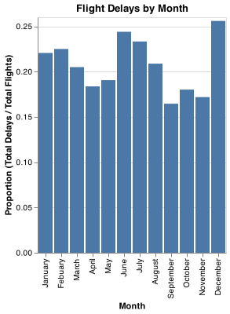
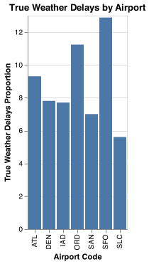

# Client Report - [Project 2]
__CSE 250__
__Bridger Hackworth__

## Elevator pitch

_Delayed flights are not something most people look forward to. Arriving hours late may result in you missing a connecting flight, job interview, or your best friend’s wedding. In 2003 the Bureau of Transportation Statistics (BTS) began collecting data on the causes of delayed flights. Analyzing this data can give us insights on delay trends that could in turn, possibly help us to avoid the worst airports or worst times to fly._

### GRAND QUESTION 1
#### Which airport has the worst delays? How did you choose to define “worst”? As part of your answer include a table that lists the total number of flights, total number of delayed flights, proportion of delayed flights, and average delay time in hours, for each airport.


_Using the "combine" pandas function, we were able to add up all of the rows based on airport code and then create two defining statistics: "flights / delays" and "average delay time" (shown in hours,as requested.) SFO (San Francisco International Airport) was the highest in both categories, so it is clearly the worst airport to fly at if you want to avoid delays, since it has the longest delays and the most frequent._

##### Python Code


```flights_2 = flights.groupby(['airport_code']).sum().reset_index()

flights_2 = flights.groupby(['airport_code']).sum().reset_index()

flights_2 = flights_2.assign(
    avg_minute_delay = lambda x: x.minutes_delayed_total / x.num_of_flights_total,
    avg_hour_delay = lambda x: x.avg_minute_delay / 60, 
    proportion = lambda x: x.num_of_delays_total / x.num_of_flights_total
)

print(flights_2
    .head(7)
    .filter(["airport_code", "num_of_delays_total", "num_of_flights_total", "proportion","avg_hour_delay"])
    .to_markdown(index=False))

```
| Airport Code   |   Delays Total |   Flights Total |   Proportion (Delays/Flights) |   Avg. Delay Time (hrs) |
|:---------------|----------------------:|-----------------------:|-------------:|-----------------:|
| ATL            |                902,443 |                4,430,047 |     0.204  |         0.203 |
| DEN            |                468,519 |                251,3974 |     0.186 |         0.167  |
| IAD            |                168,467 |                 851,571 |     0.198 |         0.201 |
| ORD            |                830,825 |                359,7588 |     0.231 |         0.261|
| SAN            |                175,132 |                 917,862 |     0.191 |         0.150 |
| SFO            |                425,604 |                1,630,945 |     0.261|         0.271  |
| SLC            |                205,160 |                1,403,384 |     0.146 |         0.120 |


### GRAND QUESTION 2
#### What is the worst month to fly if you want to avoid delays? Include one chart to help support your answer, with the x-axis ordered by month. You also need to explain and justify how you chose to handle the missing Month data.
_I beleive the simplest way to visually compare amounts of data is through bar graphs. Given the graph below, it is very evident that December is the worst month to fly. The highest percentage of flights are delayed this month._

##### TECHNICAL DETAILS

```python 
chart5 = alt.Chart(flights5).mark_bar().encode(
    alt.X(
        "month",
        sort=["January", "Febuary", "March", "April", "May", "June", "July", "August", "September", "October", "November", "December",],
        axis=alt.Axis(title="Month")
    ),
    y=alt.Y('proportion', axis=alt.Axis(title="Proportion (Total Delays / Total Flights)"))
).properties(
    title='Flight Delays by Month'

)
```




### GRAND QUESTION 3
#### According to the BTS website the Weather category only accounts for severe weather delays. Other “mild” weather delays are included as part of the NAS category and the Late-Arriving Aircraft category. Calculate the total number of flights delayed by weather (either severe or mild) using these two rules:

a. 30% of all delayed flights in the 
Late-Arriving category are due to weather.

b. From April to August, 40% of delayed flights in the NAS category are due to weather. The rest of the months, the proportion rises to 65%.

_The results are displayed in the table below._

##### Python Code

```flights6 = flights
flights6['month'] = flights['month'].replace('n/a', np.NaN).fillna(method='ffill')

flights6 = flights6.assign(
    severe = lambda x: x.num_of_delays_weather,
    fixed_late_aircraft = lambda x: x.num_of_delays_late_aircraft.replace(-999, np.NaN),
    fixed_late_aircraft1 = lambda x: x.fixed_late_aircraft.fillna(x.fixed_late_aircraft.mean()),
    fixed_late_aircraft2 = lambda x: x.fixed_late_aircraft1 * .3,
    true_nas = lambda x: np.where(
        x.month.isin(['April', 'May', 'June', 'July', 'August']), 
        x.num_of_delays_nas * 0.4,
        x.num_of_delays_nas * 0.65
        ),
    true_weather = lambda x: x.fixed_late_aircraft2 + x.severe + x.true_nas,
    true_percent_weather = lambda x: x.true_weather / x.num_of_flights_total
)

flights6 = flights6.groupby(['airport_code']).sum().reset_index()

```

```python 
print(flights6
    .head(7)
    .filter(["airport_code",
    "num_of_delays_weather",
    "true_weather"])
    .to_markdown(index=False))
```

| Airport Code   |   Severe Weather Delays |   True Weather Delays |
|:---------------|------------------------:|---------------:|
| ATL            |                   32,375 |       314,801   |
| DEN            |                   13,836 |       148,762   |
| IAD            |                    4,794 |        50,843 |
| ORD            |                   20,765 |       308,708   |
| SAN            |                    4,320 |        48,852 |
| SFO            |                   10,377 |       158,683   |
| SLC            |                    6,831 |        60,131 |

### GRAND QUESTION 4
#### Create a barplot showing the proportion of all flights that are delayed by weather at each airport. What do you learn from this graph (Careful to handle the missing Late Aircraft data correctly)?

_The missing Late Aircraft data was filled in with the mean of the Late Aircraft column. It appears that the trend is similar to the trend in total delays. This could lead one to "cut some slack" towards these airports in seeing that their poor numbers are due to factors outside of their control and not just poor logistics or negligence._

##### Python Code

```python 
chart6 = alt.Chart(flights6).mark_bar().encode(
    alt.X(
        "airport_code",
        axis=alt.Axis(title="Airport Code")
    ),
    y=alt.Y('true_percent_weather', axis=alt.Axis(title="All Weather Delays (Severe and Mild)"))
).properties(
    title='True Weather Delay Totals by Airport')
```



### GRAND QUESTION 5
#### Fix all of the varied NA types in the data to be consistent and save the file back out in the same format that was provided (this file shouldn’t have the missing values replaced with a value). Include one record example from your exported JSON file that has a missing value (No imputation in this file).

_All missing values were replaced with np.NaN. In the JSON file, this is reflected with a set of double quotations and no data in between:    
"268":"Washington, DC: Washington Dulles International","269":"","270":"San Diego, CA: San Diego International","271":"San Francisco, CA: San Francisco International","272":"","273":"",_

##### TECHNICAL DETAILS

```python 
clean = flights.assign(
    month = flights.month.replace('n/a', np.NaN), 
    num_of_delays_late_aircraft = flights.num_of_delays_late_aircraft.replace(-999, np.NaN),
    num_of_delays_carrier = flights.num_of_delays_carrier.replace("1500+", "1750").astype('int64')
    #year is already missing
)

clean.to_json('flights_clean.json')
```


## APPENDIX A (PYTHON CODE)
```python
# %%
# import packages
import pandas as pd
import numpy as np
import altair as alt

import urllib3
import json

# %%
# the long way to help us understand json files and 
# end product: imported "flights" data set
url_flights = 'https://github.com/byuidatascience/data4missing/raw/master/data-raw/flights_missing/flights_missing.json'
http = urllib3.PoolManager()
response = http.request('GET', url_flights)
flights_json = json.loads(response.data.decode('utf-8'))
flights = pd.json_normalize(flights_json)

#%%
#analyze the data
# 17 columns, 924 rows
#num_of_delays_late_aircraft have -999 for missing and minutes_delayed_nas
# airport_code                     1
# num_of_delays_weather            1
# minutes_delayed_weather          1
# minutes_delayed_security         1
# minutes_delayed_nas              1
# minutes_delayed_late_aircraft    1
# minutes_delayed_carrier          1
# num_of_delays_total              1
# num_of_delays_security           1
# airport_name                     1
# num_of_delays_nas                1
# num_of_delays_late_aircraft      1
# num_of_delays_carrier            1
# num_of_flights_total             1
# year                             1
# month                            1
# minutes_delayed_total            1
flights.columns.value_counts()
flights.shape
flights.describe()

#%%

#Question 1
#Extract below
# Airport code
# num_of_delays_total
# num_of_flights_total
# minutes_delayed_total

#%%
# 27 missing months
# no missing in num_of_delays_total
# no missing num_of_flights_total
# no missing minutes_delayed_total

#%%
flights_2 = flights.groupby(['airport_code']).sum().reset_index()

flights_2 = flights_2.assign(
    avg_minute_delay = lambda x: x.minutes_delayed_total / x.num_of_flights_total,
    avg_hour_delay = lambda x: x.avg_minute_delay / 60, 
    proportion = lambda x: x.num_of_delays_total / x.num_of_flights_total
)

print(flights_2
    .head(7)
    .filter(["airport_code", "num_of_delays_total", "num_of_flights_total", "proportion","avg_hour_delay"])
    .to_markdown(index=False))


#%%
#Question 2
# ffill fill na function
flights5 = flights
flights5['month'] = flights['month'].replace('n/a', np.NaN).fillna(method='ffill')

#%%

flights5 = flights.groupby(['month']).sum().reset_index()

flights5 = flights5.assign(
    proportion = lambda x: x.num_of_delays_total / x.num_of_flights_total
)


chart5 = alt.Chart(flights5).mark_bar().encode(
    alt.X(
        "month",
        sort=["January", "Febuary", "March", "April", "May", "June", "July", "August", "September", "October", "November", "December",],
        axis=alt.Axis(title="Month")
    ),
    y=alt.Y('proportion', axis=alt.Axis(title="Proportion (Total Delays / Total Flights)"))
).properties(
    title='Flight Delays by Month'

)

chart5

chart5.save('flight_delays_by_month.png')


#%%

# Question 3
flights6 = flights
flights6['month'] = flights['month'].replace('n/a', np.NaN).fillna(method='ffill')

flights6 = flights6.assign(
    severe = lambda x: x.num_of_delays_weather,
    fixed_late_aircraft = lambda x: x.num_of_delays_late_aircraft.replace(-999, np.NaN),
    fixed_late_aircraft1 = lambda x: x.fixed_late_aircraft.fillna(x.fixed_late_aircraft.mean()),
    fixed_late_aircraft2 = lambda x: x.fixed_late_aircraft1 * .3,
    true_nas = lambda x: np.where(
        x.month.isin(['April', 'May', 'June', 'July', 'August']), 
        x.num_of_delays_nas * 0.4,
        x.num_of_delays_nas * 0.65
        ),
    true_weather = lambda x: x.fixed_late_aircraft2 + x.severe + x.true_nas,
    true_percent_weather = lambda x: x.true_weather / x.num_of_flights_total
)

flights6 = flights6.groupby(['airport_code']).sum().reset_index()

print(flights6
    .head(7)
    .filter(["airport_code",
    "num_of_delays_weather",
    "true_weather"])
    .to_markdown(index=False))
 
#%%
#Question 4
chart6 = alt.Chart(flights6).mark_bar().encode(
    alt.X(
        "airport_code",
        axis=alt.Axis(title="Airport Code")
    ),
    y=alt.Y('true_percent_weather', axis=alt.Axis(title="All Weather Delays (Severe and Mild)"))
).properties(
    title='True Weather Delay Totals by Airport')

chart6.save('True_Weather_Delay_Totals_by_Airport.png')

# %%
# Question 5

clean = flights.assign(
    month = flights.month.replace('n/a', np.NaN), 
    num_of_delays_late_aircraft = flights.num_of_delays_late_aircraft.replace(-999, np.NaN),
    num_of_delays_carrier = flights.num_of_delays_carrier.replace("1500+", "1750").astype('int64')
    #year is already missing
)


clean.to_json('flights_clean.json')
```