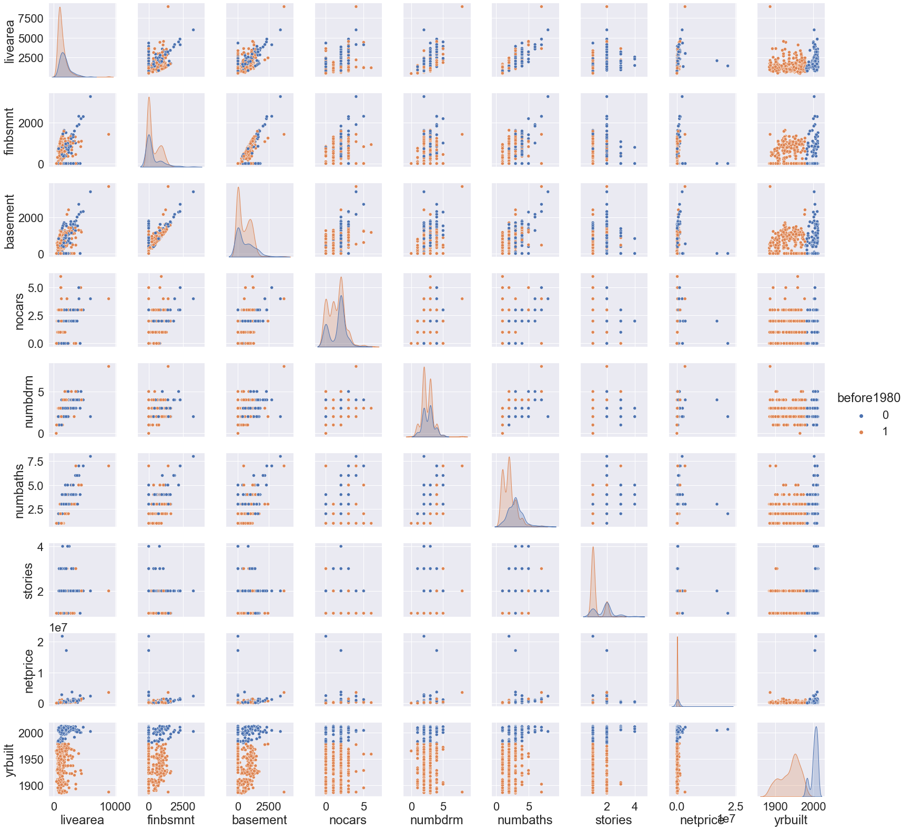

# Client Report - [Project 4: Can you predict that?]
__Course CSE 250__
__Bridger Hackworth__

## Elevator Pitch

_By 1976, the use of asbestos in paint when building homes was resctricted. Yet, houses built during and before this period are known to have materials with asbestos. In order for the state of Colorado to be aware of, and likley check all of these houses for health hazards pertaining to asbestos, they need a machine learning model that will predict if a house was built before 1980. Using houses that we have the known year for, as well as it's other attributes, we were able to create a machine learning model that will effctively predict if a house was built before 1980 or not using the known attributes of the house._

### GRAND QUESTION 1
#### 1. Create 2-3 charts that evaluate potential relationships between the home variables and before1980.

_Below are two charts that give us good insights on the reltionships and correlations between all of the numeric variables. When using the seaborn pairplot chart, nothing stands out super strongly to the average human eye as having a strong correlation, except for maybe the net price, where some extremely high outliers indicate years closer to 2000. When we look at the heatmap, it gives us a slightly better idea. We see that the number of bathrooms and living space area have the strongest correlation with year built and may be the most helpful variables in our predictive model._

##### Chart Code

```python 
#create a subset with only numeric features
h_subset = dwellings_ml.filter(['livearea', 'finbsmnt',
    'basement', 'yearbuilt', 'nocars', 'numbdrm', 'numbaths', 
    'stories', 'yrbuilt', 'before1980', 'netprice']).sample(500)
correlation = sns.pairplot(h_subset, hue = 'before1980')
correlation.savefig('save_as_a_png.png')
corr = h_subset.drop(columns = 'before1980').corr()
sns.heatmap(corr)
```

_Seaborn Pairplot_


_Seaborn Heatmap_


### GRAND QUESTION 2
#### Can you build a classification model (before or after 1980) that has at least 90% accuracy for the state of Colorado to use (explain your model choice and which models you tried)?

_We used a decision tree classification model, which esentially works by creating a series of if-then statements, kind of like a game of "20 questions". By using the data that we have been given and assume is true, we split it into two pieces. One contained the relevant features and the other contained the targets. These were each then split as well, with one piece conatining 66% of the data and the other containg 34%. The 66% was used to train the data with the features and it's corresponding targets, building the decision tree. Afterwards we ran through the other 33% of the features as a test, giving us a list of the model's predictions. We were then able to compare it to the un-used 33% of the target data. 95.7% of the predictions matched the test target data. This appeared to be sufficient, as it met the 90% accuracy requirement, allowing us to move on without much need for trying other models._

##### Model Code

```python 
from sklearn.model_selection import train_test_split
from sklearn import tree

#add in the neighborhood dataset that provides one more extra feature
ml = dwellings_ml.merge(dwellings_neighborhoods_ml)
#create two arrays oof targets and features
X_pred = ml.drop(['before1980', 'yrbuilt', 'parcel'], axis = 1)
y_pred = ml.filter(["before1980"], axis = 1)

# each array is split into two arrays (4 total arrays) with 34% of the original array being the test data and 66% being the training data
# rando_state 76 will shuffle both arrays in the same way
X_train, X_test, y_train, y_test = train_test_split(
    X_pred, 
    y_pred, 
    test_size = .34, 
    random_state = 76)   
# instantiate Decision Tree Classifier object
clf = tree.DecisionTreeClassifier()
# pass the train features along with the train targets to tree object; trains the model
clf = clf.fit(X_train, y_train)
#pass in the test features and save the model's predictions as y_pred
y_pred = clf.predict(X_test)
#compare what percent of the model's prediction were correct
#works with 95.7% accuracy
score = accuracy_score(y_test,y_pred)
```


### GRAND QUESTION 3
#### Will you justify your classification model by detailing the most important features in your model (a chart and a description are a must)?
_Yes. I will as follows:_

 _Cool enough, the CLF class has a method that tells us the features that were the most important, giving it a score between 0 and 1. Based on the results, it was easiest for the model to make a prediction when the house was one story. This is not to say that the architerteral style was always the category that was the most indicative, but specifcally when it was a one story style. The same goes for an "att" garage type, followed by a "C-quality house". The top values are displayed below in an altair chart._

##### Chart Code

```python 
df_features = pd.DataFrame(
    {'f_names': X_train.columns, 
    'f_values': clf.feature_importances_}).sort_values('f_values', ascending = False)
f_chart = alt.Chart(df_features.query("f_values > .012")).
encode(
    alt.X('f_values'), 
alt.Y('f_names', sort = "-x")
).mark_bar()
f_chart.save('f_chart.png')
```

_Feature Importance_


### GRAND QUESTION 4
#### Can you describe the quality of your classification model using 2-3 evaluation metrics? You need to provide an interpretation of each evaluation metric when you provide the value.

_In this case, it is imperative that we identify every house that was built before 1980. Some will have health hazards and some will not. It is ok if we check a few more houses that were built after 1980 and have no risk of health hazards. We may spend a few extra resources, but this is better than risking missing a house with asbestos, risking the health and safety of residents. That is why in this case a false negative would be worse than a false postive._ 
#####Precision: 5668/5884 (96%)
_Out of all houses that needed to be checked 96% of them were correctly identified with this model._
#####Recall: 5668/5878 (96%)
_96% of the time that the model declared the house before 1980, it was correct._
#####F-1 Score: (96%)
_The harmonic mean between our model's recall and precision. One could say that this model is 96% competent. Some adjsutemnets should be made if we don't want to let the last 4% of the before 1980 houses get away. We would need to make some adjustments on the threshhold. The ideal threshold could be figured out using an ROC curve, giving us a good place to start for future development on this model._

 

##### TECHNICAL DETAILs
```python 
sns.set(font_scale=1)
print(metrics.confusion_matrix(y_test, y_pred))
c_matrix = metrics.plot_confusion_matrix(clf, X_test, y_test)
print(metrics.classification_report(y_test, y_pred))
```

_Confusion Matrix_


## APPENDIX A (PYTHON CODE)
```python
import sys
!{sys.executable} -m pip install seaborn scikit-learn
# the full imports
import pandas as pd 
import numpy as np
import seaborn as sns
import altair as alt
# the from imports
from sklearn.model_selection import train_test_split
from sklearn import tree
from sklearn.naive_bayes import GaussianNB
from sklearn.ensemble import GradientBoostingClassifier
from sklearn import metrics
from sklearn.metrics import accuracy_score
dwellings_denver = pd.read_csv("https://github.com/byuidatascience/data4dwellings/raw/master/data-raw/dwellings_denver/dwellings_denver.csv")
dwellings_ml = pd.read_csv("https://github.com/byuidatascience/data4dwellings/raw/master/data-raw/dwellings_ml/dwellings_ml.csv")
dwellings_neighborhoods_ml = pd.read_csv("https://github.com/byuidatascience/data4dwellings/raw/master/data-raw/dwellings_neighborhoods_ml/dwellings_neighborhoods_ml.csv")   

# Question 1: Create 2-3 charts that evaluate potential relationships between the home variables and before1980.
h_subset = dwellings_ml.filter(['livearea', 'finbsmnt',
    'basement', 'yearbuilt', 'nocars', 'numbdrm', 'numbaths', 
    'stories','netprice', 'yrbuilt', 'before1980']).sample(500)
sns.set(font_scale=2)
correlation = sns.pairplot(h_subset, hue = 'before1980')
correlation.savefig('save_as_a_png.png')
corr = h_subset.drop(columns = 'before1980').corr()
heatmap = sns.heatmap(corr)
heatmap.savefig('heatmap.png')
# num of baths, stories, living area

#Question 2: Can you build a classification model (before or after 1980) that has at least 90% accuracy for the state of Colorado to use (explain your model choice and which models you tried)?
from sklearn.model_selection import train_test_split
from sklearn import tree
from sklearn.naive_bayes import GaussianNB
from sklearn import metrics
#add in the neighborhood dataset that provides one more extra feature
ml = dwellings_ml.merge(dwellings_neighborhoods_ml)
# X_pred has all data excpet for our targets of before 1980 and yrbuilt. Parcel is dropped becuase it is the only non-numeric value
# why do we need to include the axis = 1 argument?
X_pred = ml.drop(['before1980', 'yrbuilt', 'parcel'], axis = 1)
# array with target columns 
y_pred = ml.filter(["before1980"], axis = 1)
# each array is split into two arrays with 34% of the array being the test data and 66% being the training data
# rando_state 76 will shuffle both arrays in the same way
X_train, X_test, y_train, y_test = train_test_split(
    X_pred, 
    y_pred, 
    test_size = .34, 
    random_state = 76)   
# instantiate Decision Tree Classifier object
clf = tree.DecisionTreeClassifier()
# pass the train features along with the train targets to tree object
clf = clf.fit(X_train, y_train)
#pass in the test features and save the preictions as y_pred
y_pred = clf.predict(X_test)
y_probs = clf.predict_proba(X_test)
#works with 95.7% accuracy
score = accuracy_score(y_test,y_pred)

#Q3 Will you justify your classification model by detailing the most important features in your model (a chart and a description are a must)?
df_features = pd.DataFrame(
    {'f_names': X_train.columns, 
    'f_values': clf.feature_importances_}).sort_values('f_values', ascending = False)
f_chart = alt.Chart(df_features.query("f_values > .012")).encode(alt.X('f_values'), alt.Y('f_names', sort = "-x")).mark_bar()
f_chart.save('f_chart.png')

# Q4 Can you describe the quality of your classification model using 2-3 evaluation metrics? You need to provide an interpretation of each evaluation metric when you provide the value.
sns.set(font_scale=1)
print(metrics.confusion_matrix(y_test, y_pred))
c_matrix = metrics.plot_confusion_matrix(clf, X_test, y_test)
print(metrics.classification_report(y_test, y_pred))
metrics.plot_roc_curve(clf, X_test, y_test)
```