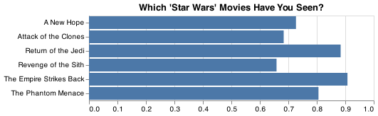
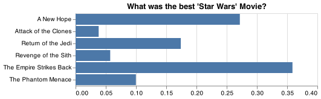

# Client Report - [Project5]
__Course CSE 250__
__Bridger Hackworth__

## Elevator pitch

_Is there a strong correlation between star wars fans, their knowledge of the popular franchise, and their income? We can try to use a machine learning model to attempt to prove this._

### GRAND QUESTION 1
#### Shorten the column names and clean them up for easier use with pandas.
_Most wrangling that was needed for this project was in the column headings. The questions were split amongst two rows. They also were questions the represented "select multiple" questions followed by questions that were only asked if someone responded yes to a previous question. We used some string functions to edit the column cells and then combine them into one column using the concat string function._

##### TECHNICAL DETAILS

```python 
#Questions are spread across two rows
questions_raw = pd.read_csv(url, encoding = "ISO-8859-1", nrows = 1).melt()

responses_raw = pd.read_csv(url, skiprows=2, header = None, encoding = "ISO-8859-1" )


# Merge the two top rows so that each column represents a single question
# Goal: Seen_movie, rank_movie, view_character, the rest are simple questions
variables_replace = {
    'Which of the following Star Wars films have you seen\\? Please select all that apply\\.':'seen',
    'Please rank the Star Wars films in order of preference with 1 being \
    your favorite film in the franchise and 6 being your least favorite film.':'rank',
    'Please state whether you view the following characters favorably, unfavorably, or are unfamiliar with him/her.':'view',
    'Do you consider yourself to be a fan of the Star Trek franchise\\?':'star_trek_fan',
    'Do you consider yourself to be a fan of the Expanded Universe\\?\x8cæ':'expanded_fan',
    'Are you familiar with the Expanded Universe\\?':'know_expanded',
    'Have you seen any of the 6 films in the Star Wars franchise\\?':'seen_any',
    'Do you consider yourself to be a fan of the Star Wars film franchise\\?':'star_wars_fans',
    'Which character shot first\\?':'shot_first',
    'Unnamed: \d{1,2}':np.nan,
    ' ':'_'
}

#"response" and "unnamed" are essentially a blank spaces but we don't want to forward fill "response"
# "Star wars episode" is redundant
values_replace = {
    'Response':'',
    'Star Wars: Episode ':'',
    ' ':'_'
}


#1. Replace values using dictionary
#2. forward fill will only work on variable column
#3. fill first NaN to keep respondentid after concat
#4. concat two columns with __ in the middle
#5. strip any trailing __ and make lowercase
questions_well_done = questions_raw\
.assign(
        variable_replace = lambda x: x.variable.str.strip().replace(variables_replace, regex=True),
       value_replace = lambda x:  x.value.str.strip().replace(values_replace, regex=True)
    )\
    .fillna(method = 'ffill')\
    .fillna(value = "")\
    .assign(column_names = lambda x: x.variable_replace.str.cat(x.value_replace, sep = "__").str.strip('__').str.lower())

dat.columns = questions_well_done.column_names.to_list()
```


### GRAND QUESTION 2
#### Filter the dataset to those that have seen at least one film.
_Using the query funtion was a good start, but some people marked that they had seen star wars but then proceeded to not mark a single film as seen. Using a filter of the film title columns, we were then able to use the isnull().all(1) functions to drop the rows that were all na in these columns._

##### TECHNICAL DETAILS

```python 

dat = dat.query("seen_any == 'Yes'")

seenm = dat.filter(['seen__i__the_phantom_menace',	'seen__ii__attack_of_the_clones',\
'seen__iii__revenge_of_the_sith','seen__iv__a_new_hope',\
'seen__v_the_empire_strikes_back',	'seen__vi_return_of_the_jedi'])

#some people said they had seen some star wars but then marked na for every question
dat = dat.drop(index=seenm.index[seenm.isnull().all(1)])
```


### GRAND QUESTION 3
#### Please validate that the data provided on GitHub lines up with the article by recreating 2 of their visuals and calculating 2 summaries that they report in the article.

_This required a bit of wrangling in order to get the data in the correct format to diplay in an altair chart. This was also where it was discovered that some people had marked "Yes" on seen star wars when it should have been a "No" because the chart did not match up with FiveThirtyEight's at first. There were likley better and cleaner ways to manipulate the data than the way it was done here, but using these for loops to build lists and build new Data Frames still got the job done._

##### This is the code that was used to wrangle the data as well as the code istlef for the first chart.

```python 
seenm = seenm.drop(index=seenm.index[seenm.isnull().all(1)])

#create a list with for have seen/835 for each movie
freqs = []
for column in seenm.columns:
    freqs.append(((835)-seenm[column].isna().sum())/835)

mnames = ['The Phantom Menace',	'Attack of the Clones',	'Revenge of the Sith', 'A New Hope', 'The Empire Strikes Back',	'Return of the Jedi']

#make data frame from two lists
freqs_pd = pd.DataFrame(list(zip(mnames, freqs)), columns = ('Movie_Names', 'Frequencies'))

which_have_seen = alt.Chart(freqs_pd).mark_bar().encode(
    alt.X(
        "Frequencies:Q",
        axis=alt.Axis(title="")
    ),
    y=alt.Y('Movie_Names:O', axis=alt.Axis(title=""))
).properties(
    title="Which \'Star Wars\' Movies Have You Seen?"
)
```



##### This is the code for the second chart, as well as it's data manipulation.
```python 
top_movie = dat.filter(['seen__i__the_phantom_menace',	'seen__ii__attack_of_the_clones',	'seen__iii__revenge_of_the_sith',\
    'seen__iv__a_new_hope',	'seen__v_the_empire_strikes_back',	'seen__vi_return_of_the_jedi'])

indices = top_movie.index[top_movie.notna().all(1)]

drop_index = []
for i in top_movie.index:
    if i not in indices:
        drop_index.append(i)

top_movie = dat.filter(['rank__i__the_phantom_menace',	'rank__ii__attack_of_the_clones',\
	'rank__iii__revenge_of_the_sith','rank__iv__a_new_hope',	'rank__v_the_empire_strikes_back',	'rank__vi_return_of_the_jedi']).drop(index=drop_index)

top_movie.columns

names = []
pop = []
for column in top_movie.columns:
    frame = top_movie.groupby(column).count().reset_index()
    names.append(column)
    pop.append((frame.iat[0,1])/471)

top = {'movie' : names, 'popularity': pop}

top = pd.DataFrame.from_dict(top)


top_rank = alt.Chart(top).mark_bar().encode(
    alt.X(
        "popularity:Q",
        axis=alt.Axis(title="")
    ),
    y=alt.Y('movie:O', axis=alt.Axis(title=""))
).properties(
    title="What was the best \'Star Wars\' Movie?"
)
```




### GRAND QUESTION 4
#### Clean and format the data so that it can be used in a machine learning model. Please achieve the following requests and provide examples of the table with a short description the changes made in your report.

### a.
#### Create an additional column that converts the age ranges to a number and drop the age range categorical column.

_For each age range it was decided to use the minimum since the highest range of ">65" only included the minimum. Turning the categorical data into actual integers makes it more usefull to a machine learning model. Using some string funtions like split and strip, this was pretty straighforward. The code is shown below._

```python 
#remove all na values
dat = dat.dropna(subset=['household_income', 'age', 'star_wars_fans'])

#we will turn the min in each age range into an int that represents the range
min_age = dat.age.str.split("-", expand = True).rename({0:"age_min", 1:"age_max"}, axis = 1).age_min.str.replace("> ","").astype("int")


dat = dat.join(min_age).drop(columns='age')
```

### b.
#### Create an additional column that converts the school groupings to a number and drop the school categorical column.
_Generally in the United States, each level of education represents a certain number of years of school. In the code below, the grade mapping_dictionary shows the integers that were used to represent each value._

##### TECHNICAL DETAILS

```python 
#change each education level to most likely years in school
grade_mapping = {
    "Less than high school degree": 9,
    "High school degree":12,
    "Some college or Associate degree": 14,
    "Bachelor degree": 16,
    "Graduate degree": 18
}

dat.columns

dat['education'] = dat.education.replace(grade_mapping)
```


### c.
#### Create an additional column that converts the income ranges to a number and drop the income range categorical column.
_The minumum value in the range was also chosen to represent each range in this case as well. In this case, not only does the top range only included the minimum, but it makes more sense for the machine learning target because we are guessing if an income is above a certain value._

##### TECHNICAL DETAILS

```python 
min_income = dat.household_income.str.split("-", expand = True).rename({0:"income_min", 1:"income_max"}, axis = 1).income_min.str.replace(',',"").str.replace('$',"").str.replace('+',"").astype('int')

dat = dat.join(min_income).drop(columns='household_income')
```
### d.
#### Create your target (also known as label) column based on the new income range column.
_Using lambda, a new column was assigned that contains only values of "True" or "False", to say whether or not a the income of the responding subject was greater than $50,000._

##### TECHNICAL DETAILS

```python 
dat = dat.assign(k50 = lambda x: x.income_min >= 50000)
```

### e.
### One-hot encode all remaining categorical columns.
_First we made sure to change all "Yes-No" questions into "Yes-No" answers. In the "seen" questions, the movie title means it is a "Yes" and the "Na" means "No". Next, a number value was given to represnt how favorable people saw characters on a scale of 1 - 5 that matched up with the responses. "Male" was changed to 1 and "Female" was changed to 0. All "Yes" in the data set where then replaced with ones and all "Nos" with 0s. The only categorical data left afterwards were location and who shot first. We used the dummies function then for those columns. They didn't end up adding to many columns because there wasn't a high variance in responses, since they are multiple choice questions._

##### TECHNICAL DETAILS

```python 
seen_Yes = {
    'Star Wars: Episode I  The Phantom Menace' : 'Yes', 
    'Star Wars: Episode II  Attack of the Clones' : 'Yes',
    'Star Wars: Episode III  Revenge of the Sith' : 'Yes',	
    'Star Wars: Episode IV  A New Hope' : 'Yes',	
    'Star Wars: Episode V The Empire Strikes Back' : 'Yes',	
    'Star Wars: Episode VI Return of the Jedi': 'Yes'
    }

# change "have seen" questions to "yes no" answers
Yes_no = dat.filter(['seen__i__the_phantom_menace',	'seen__ii__attack_of_the_clones',	'seen__iii__revenge_of_the_sith',\
	'seen__iv__a_new_hope',	'seen__v_the_empire_strikes_back',	'seen__vi_return_of_the_jedi']).replace(seen_Yes).replace(np.nan, 'No')

dat = dat.drop(columns= ['seen__i__the_phantom_menace',	'seen__ii__attack_of_the_clones',	'seen__iii__revenge_of_the_sith',\
	'seen__iv__a_new_hope',	'seen__v_the_empire_strikes_back',	'seen__vi_return_of_the_jedi']).join(Yes_no)

dat = dat.replace('Yes', 1).replace('No', 0)


#change view of character to numeric values
view = {'Somewhat favorably': 4,
'Very favorably': 5,
'Neither favorably nor unfavorably (neutral)': 3,
'Somewhat unfavorably': 2,
'Unfamiliar (N/A)': 0,
np.nan : 0, 
'Very unfavorably' : 1 }

dat = dat.replace(view)

gender = {'Male' : 1, 'Female': 0}

dat = dat.replace(gender)

#use dummies for all categorical data shot first and location
region = pd.get_dummies(dat.filter(['location_(census_region)']), dummy_na = True)
dat = dat.join(region)

shot_first = pd.get_dummies(dat.filter(['shot_first']), dummy_na = True)
dat = dat.join(shot_first)

dat = dat.drop(columns="location_(census_region)").drop(columns='shot_first')
```
### GRAND QUESTION 5
### Build a machine learning model that predicts whether a person makes more than $50k.
_As it turns out, Star wars knowledge isn't a great indicator of a person's income. The accuracy of this model was only about 50% when comparing it to the test data. A Decison Tree model still seemed the most appropriate to use here when making the attempt. A Random Forest model was attempted but it only returned integers and not "True" or "False" labels that matched the target values._

##### TECHNICAL DETAILS

```python 
from sklearn.metrics import mean_absolute_error
from sklearn.model_selection import train_test_split
from sklearn.ensemble import RandomForestRegressor
from sklearn.metrics import accuracy_score
from sklearn import tree

y = dat.k50
X = dat.drop(columns=['income_min', 'k50', 'respondentid'])


X_train, X_test, y_train, y_test = train_test_split(
    X, 
    y, 
    test_size = .34, 
    random_state = 76)   

model = tree.DecisionTreeClassifier(random_state=79)

model.fit(X_train, y_train)
y_pred = model.predict(X_test)
score = accuracy_score(y_test,y_pred)

```


## APPENDIX A (PYTHON CODE)
```python
"""
Project 5: The War with Star Wars
"""
#%%
#imports
import pandas as pd 
import altair as alt
import numpy as np
from pyparsing import Regex
from vega_datasets import data
#%%
# Question 1: Shorten the column names and clean them up for easier use with pandas.
url = 'https://github.com/fivethirtyeight/data/raw/master/star-wars-survey/StarWars.csv'

#remember to always know the encoding for a file
dat = pd.read_csv(url, encoding = 'latin1')
# %%
#Questions are spread across two rows
questions_raw = pd.read_csv(url, encoding = "ISO-8859-1", nrows = 1).melt()

responses_raw = pd.read_csv(url, skiprows=2, header = None, encoding = "ISO-8859-1" )


# Merge the two top rows so that each column represents a single question
# Goal: Seen_movie, rank_movie, view_character, the rest are simple questions
variables_replace = {
    'Which of the following Star Wars films have you seen\\? Please select all that apply\\.':'seen',
    'Please rank the Star Wars films in order of preference with 1 being your favorite film in the franchise and 6 being your least favorite film.':'rank',
    'Please state whether you view the following characters favorably, unfavorably, or are unfamiliar with him/her.':'view',
    'Do you consider yourself to be a fan of the Star Trek franchise\\?':'star_trek_fan',
    'Do you consider yourself to be a fan of the Expanded Universe\\?\x8cæ':'expanded_fan',
    'Are you familiar with the Expanded Universe\\?':'know_expanded',
    'Have you seen any of the 6 films in the Star Wars franchise\\?':'seen_any',
    'Do you consider yourself to be a fan of the Star Wars film franchise\\?':'star_wars_fans',
    'Which character shot first\\?':'shot_first',
    'Unnamed: \d{1,2}':np.nan,
    ' ':'_'
}

#"response" and "unnamed" are essentially a blank spaces but we don't want to forward fill "response"
# "Star wars episode" is redundant
values_replace = {
    'Response':'',
    'Star Wars: Episode ':'',
    ' ':'_'
}


#1. Replace values using dictionary
#2. forward fill will only work on variable column
#3. fill first NaN to keep respondentid after concat
#4. concat two columns with __ in the middle
#5. strip any trailing __ and make lowercase
questions_well_done = questions_raw\
.assign(
        variable_replace = lambda x: x.variable.str.strip().replace(variables_replace, regex=True),
       value_replace = lambda x:  x.value.str.strip().replace(values_replace, regex=True)
    )\
    .fillna(method = 'ffill')\
    .fillna(value = "")\
    .assign(column_names = lambda x: x.variable_replace.str.cat(x.value_replace, sep = "__").str.strip('__').str.lower())

dat.columns = questions_well_done.column_names.to_list()

#%%
# Question 2: Filter the dataset to those that have seen at least one film.

dat = dat.query("seen_any == 'Yes'")

seenm = dat.filter(['seen__i__the_phantom_menace',	'seen__ii__attack_of_the_clones',	'seen__iii__revenge_of_the_sith','seen__iv__a_new_hope',	'seen__v_the_empire_strikes_back',	'seen__vi_return_of_the_jedi'])

#some people said they had seen some star wars but then marked na for every question
dat = dat.drop(index=seenm.index[seenm.isnull().all(1)])

#%% 
# Question 3: Please validate that the data provided on GitHub lines up with the article by recreating 2 of their visuals and calculating 2 summaries that they report in the article.

#do the same drop on the filtered datset
seenm = seenm.drop(index=seenm.index[seenm.isnull().all(1)])

#create a list with for have seen/835 for each movie
freqs = []
for column in seenm.columns:
    freqs.append(((835)-seenm[column].isna().sum())/835)

mnames = ['The Phantom Menace',	'Attack of the Clones',	'Revenge of the Sith', 'A New Hope', 'The Empire Strikes Back',	'Return of the Jedi']

#make data frame from two lists
freqs_pd = pd.DataFrame(list(zip(mnames, freqs)), columns = ('Movie_Names', 'Frequencies'))

which_have_seen = alt.Chart(freqs_pd).mark_bar().encode(
    alt.X(
        "Frequencies:Q",
        axis=alt.Axis(title="")
    ),
    y=alt.Y('Movie_Names:O', axis=alt.Axis(title=""))
).properties(
    title="Which \'Star Wars\' Movies Have You Seen?"
)


which_have_seen.save('total_seen.png')

#%%
#Top ranked movies
top_movie = dat.filter(['seen__i__the_phantom_menace',	'seen__ii__attack_of_the_clones',	'seen__iii__revenge_of_the_sith','seen__iv__a_new_hope',	'seen__v_the_empire_strikes_back',	'seen__vi_return_of_the_jedi'])

indices = top_movie.index[top_movie.notna().all(1)]

drop_index = []
for i in top_movie.index:
    if i not in indices:
        drop_index.append(i)

top_movie = dat.filter(['rank__i__the_phantom_menace',	'rank__ii__attack_of_the_clones',	'rank__iii__revenge_of_the_sith','rank__iv__a_new_hope',	'rank__v_the_empire_strikes_back',	'rank__vi_return_of_the_jedi']).drop(index=drop_index)

top_movie.columns

pop = []
for column in top_movie.columns:
    frame = top_movie.groupby(column).count().reset_index()
    pop.append((frame.iat[0,1])/471)

top = {'movie' : mnames, 'popularity': pop}

top = pd.DataFrame.from_dict(top)


top_rank = alt.Chart(top).mark_bar().encode(
    alt.X(
        "popularity:Q",
        axis=alt.Axis(title="")
    ),
    y=alt.Y('movie:O', axis=alt.Axis(title=""))
).properties(
    title="What was the best \'Star Wars\' Movie?"
)

top_rank.save('top_rank.png')

#%%
# Question 4: Clean and format the data so that it can be used in a machine learning model. Please achieve the following requests and provide examples of the table with a short description the changes made in your report.

# 4a: Create an additional column that converts the age ranges to a number and drop the age range categorical column.


#remove all na values
dat = dat.dropna(subset=['household_income', 'age', 'star_wars_fans'])

#we will turn the min in each age range into an int that represents the range
min_age = dat.age.str.split("-", expand = True).rename({0:"age_min", 1:"age_max"}, axis = 1).age_min.str.replace("> ","").astype("int")


dat = dat.join(min_age).drop(columns='age')
#%%
# 4b: Create an additional column that converts the school groupings to a number and drop the school categorical column.

#change each education level to most likely years in school
grade_mapping = {
    "Less than high school degree": 9,
    "High school degree":12,
    "Some college or Associate degree": 14,
    "Bachelor degree": 16,
    "Graduate degree": 18
}

dat.columns

dat['education'] = dat.education.replace(grade_mapping)

#%%
# 4c: Create an additional column that converts the income ranges to a number and drop the income range categorical column.

min_income = dat.household_income.str.split("-", expand = True).rename({0:"income_min", 1:"income_max"}, axis = 1).income_min.str.replace(',',"").str.replace('$',"").str.replace('+',"").astype('int')

dat = dat.join(min_income).drop(columns='household_income')

# 4d: Create your target (also known as label) column based on the new income range column.

nas = []
for col in dat.columns:
    dat.columns.isna().sum

dat = dat.assign(k50 = lambda x: x.income_min >= 50000)

# 4e: One-hot encode all remaining categorical columns.

seen_Yes = {
    'Star Wars: Episode I  The Phantom Menace' : 'Yes', 
    'Star Wars: Episode II  Attack of the Clones' : 'Yes',
    'Star Wars: Episode III  Revenge of the Sith' : 'Yes',	
    'Star Wars: Episode IV  A New Hope' : 'Yes',	
    'Star Wars: Episode V The Empire Strikes Back' : 'Yes',	
    'Star Wars: Episode VI Return of the Jedi': 'Yes'
    }

# change "have seen" questions to "yes no" answers
Yes_no = dat.filter(['seen__i__the_phantom_menace',	'seen__ii__attack_of_the_clones',	'seen__iii__revenge_of_the_sith',	'seen__iv__a_new_hope',	'seen__v_the_empire_strikes_back',	'seen__vi_return_of_the_jedi']).replace(seen_Yes).replace(np.nan, 'No')

dat = dat.drop(columns= ['seen__i__the_phantom_menace',	'seen__ii__attack_of_the_clones',	'seen__iii__revenge_of_the_sith',	'seen__iv__a_new_hope',	'seen__v_the_empire_strikes_back',	'seen__vi_return_of_the_jedi']).join(Yes_no)

dat = dat.replace('Yes', 1).replace('No', 0)


#change view of character to numeric values
view = {'Somewhat favorably': 4,
'Very favorably': 5,
'Neither favorably nor unfavorably (neutral)': 3,
'Somewhat unfavorably': 2,
'Unfamiliar (N/A)': 0,
np.nan : 0, 
'Very unfavorably' : 1 }

dat = dat.replace(view)

gender = {'Male' : 1, 'Female': 0}

dat = dat.replace(gender)

#use dummies for all categorical data shot first and location
region = pd.get_dummies(dat.filter(['location_(census_region)']), dummy_na = True)
dat = dat.join(region)

shot_first = pd.get_dummies(dat.filter(['shot_first']), dummy_na = True)
dat = dat.join(shot_first)

dat = dat.drop(columns="location_(census_region)").drop(columns='shot_first')


# Question 5: Build a machine learning model that predicts whether a person makes more than $50k
# %%
from sklearn.metrics import mean_absolute_error
from sklearn.model_selection import train_test_split
from sklearn.ensemble import RandomForestRegressor
from sklearn.metrics import accuracy_score
from sklearn import tree
#%%
y = dat.k50
X = dat.drop(columns=['income_min', 'k50', 'respondentid'])


X_train, X_test, y_train, y_test = train_test_split(
    X, 
    y, 
    test_size = .34, 
    random_state = 76)   

model = tree.DecisionTreeClassifier(random_state=79)

model.fit(X_train, y_train)
y_pred = model.predict(X_test)
score = accuracy_score(y_test,y_pred)

model.feature_importances_

df_features = pd.DataFrame(
    {'f_names': X_train.columns, 
    'f_values': model.feature_importances_}).sort_values('f_values', ascending = False)

f_chart = alt.Chart(df_features.query("f_values > .0")).encode(alt.X('f_values'), alt.Y('f_names', sort = "-x")).mark_bar()

score
```