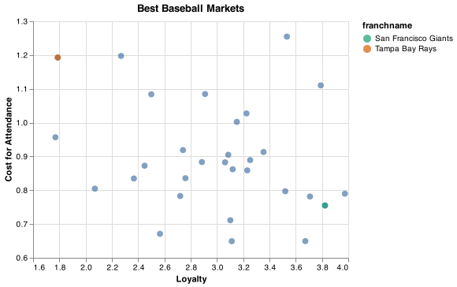

# Client Report - [Project 3: Finding relationships in baseball]
__Course CSE 250__
__Bridger Hackworth__

## Elevator pitch

_Data becomes more and more important in todays world, even in sports. Using baseball data, we were able to provide some meaningful insights that could possibly help teams find more success._

### GRAND QUESTION 1
#### Write an SQL query to create a new dataframe about baseball players who attended BYU-Idaho. The new table should contain five columns: playerID, schoolID, salary, and the yearID/teamID associated with each salary. Order the table by salary (highest to lowest) and print out the table in your report.

_While there are only two players from Rick's College that played in the MLB, they each played for multiple years with varying salaries Each salary is diplayed in the table._

##### TECHNICAL DETAILS

```SQL
SELECT DISTINCT s.playerid, 
    s.yearid, 
    s.teamid,
    s.salary,
    cp.schoolid
FROM salaries as s
    JOIN CollegePlaying as cp ON s.playerid = cp.playerid
WHERE schoolid = 'idbyuid'
ORDER BY salary DESC
```

```python 
print(question1
    .head(15)
    .filter(["playerid", "yearid",
"salary", "schoolid"])
    .to_markdown(index=False))
```

| playerid   |   yearid |   salary | schoolid   |
|:-----------|---------:|---------:|:-----------|
| lindsma01  |     2014 |  4000000 | idbyuid    |
| lindsma01  |     2012 |  3600000 | idbyuid    |
| lindsma01  |     2011 |  2800000 | idbyuid    |
| lindsma01  |     2013 |  2300000 | idbyuid    |
| lindsma01  |     2010 |  1625000 | idbyuid    |
| stephga01  |     2001 |  1025000 | idbyuid    |
| stephga01  |     2002 |   900000 | idbyuid    |
| stephga01  |     2003 |   800000 | idbyuid    |
| stephga01  |     2000 |   550000 | idbyuid    |
| lindsma01  |     2009 |   410000 | idbyuid    |
| lindsma01  |     2008 |   395000 | idbyuid    |
| lindsma01  |     2007 |   380000 | idbyuid    |
| stephga01  |     1999 |   215000 | idbyuid    |
| stephga01  |     1998 |   185000 | idbyuid    |
| stephga01  |     1997 |   150000 | idbyuid    |

### GRAND QUESTION 2
#### This three-part question requires you to calculate batting average (number of hits divided by the number of at-bats)
### a.
#### Write an SQL query that provides playerID, yearID, and batting average for players with at least one at bat. Sort the table from highest batting average to lowest, and show the top 5 results in your report.

_There are some players that batted one for one, giving them a 100% batting average, making the data we have here not very insightful._

##### SQL Query

```SQL 
SELECT playerid,
yearid,
h / ab as batting_avg
FROM batting
WHERE ab >= 1
ORDER BY h / ab DESC
LIMIT 5;
```
##### Table

```python 
print(question2a
    .head(5)
    .filter(["playerid", "yearid", "batting_avg"])
    .to_markdown(index=False))
```
| playerid   |   yearid |   batting_avg |
|:-----------|---------:|--------------:|
| snowch01   |     1874 |             1 |
| baldwki01  |     1884 |             1 |
| oconnfr01  |     1893 |             1 |
| gumbebi01  |     1893 |             1 |
| mccafsp01  |     1889 |             1 |


### b.
#### Use the same query as above, but only include players with more than 10 “at bats” that year. Print the top 5 results.

_This improves the result slightly but still is not extremely insightful. Maybe it can show us players that were underutilized or not given enough opportnity._

##### SQL Query

```SQL 
SELECT playerid,
yearid,
h/ab as Batting_Average
FROM Batting
WHERE ab >= 10
ORDER BY h/ab DESC
LIMIT 5
```
##### Table

```python 
print(question2b
    .head(5)
    .filter(["playerid", "yearid", "Batting_Average"])
    .to_markdown(index=False))
```
| playerid   |   yearid |   Batting_Average |
|:-----------|---------:|------------------:|
| nymanny01  |     1974 |          0.642857 |
| carsoma01  |     2013 |          0.636364 |
| altizda01  |     1910 |          0.6      |
| johnsde01  |     1975 |          0.6      |
| silvech01  |     1948 |          0.571429 |

### c.
#### Now calculate the batting average for players over their entire careers (all years combined). Only include players with more than 100 at bats, and print the top 5 results.

_This gives us better data. The "yearid" column was removed, as it became irrelevant when we grouped all years by player._

##### SQL Query

```SQL 
SELECT playerid,
SUM (h) / SUM (ab) as Batting_Average
FROM Batting 
GROUP BY playerid
HAVING ab > 100
ORDER BY Batting_Average DESC
LIMIT 5
```

```python 
print(question2c
    .head(5)
    .filter(["playerid", "Batting_Average"])
    .to_markdown(index=False))
```

| playerid   |   Batting Average |
|:-----------|------------------:|
| cobbty01   |          0.366299 |
| barnero01  |          0.359682 |
| meyerle01  |          0.355509 |
| kingst01   |          0.352941 |
| delahed01  |          0.345806 |

### GRAND QUESTION 3
#### Pick any two baseball teams and compare them using a metric of your choice (average salary, home runs, number of wins, etc.). Write an SQL query to get the data you need. Use Python if additional data wrangling is needed, then make a graph in Altair to visualize the comparison. Provide the visualization and its description.


_Most revenue for baseball teams comes from attendance to games. Ideally, the more wins a  team gets, the more game attendance they will have. The more they pay their players the better players they will have and the more wins they will get. So franchises pay more for their players with hopes of getting more attendance at games. Two ratios were then calculated for the years 2000 - 2019: "dollars payed to players" / "attendance" and "attendance" / ("wins" * 10000). They both will be reffered to respectively as "cost for attendance" and "loyalty score" (reffering to the fans who attend more games despite less wins). These scores can help us see which are the best markets are for a baseball team and help see what teams get the most ROI. Two teams stood out as the best and the worst. The San Francisco Giants had the 2nd highest loyalty score as well as the fourth lowest cost of attendance. The Tampa Bay Rays had the third highest cost of attendance as well as the second lowest loyalty score. On the graph, the closer to the bottom right corner, the better ROI we can assume for the teams. The blue points were included for reference with the rest of the MLB franchises._

##### SQL Query

```SQL 
SELECT teams.franchid,
    TeamsFranchises.franchname,
    SUM (teams.w) as wins,
    SUM (Salaries.salary) as all_dollars_payed,
    SUM (teams.attendance) as all_time_attendance,
    SUM (Salaries.salary) / SUM (teams.attendance) as cost_of_attendance,
    SUM (teams.attendance) / (SUM (teams.w) * 10000) as loyalty 
FROM teams
    JOIN Salaries ON Salaries.teamid = teams.teamid
    JOIN TeamsFranchises ON teams.franchid = TeamsFranchises.franchid
WHERE Teams.yearid > 1999
GROUP BY Teams.franchid
ORDER BY loyalty DESC
```

```python 
question3d = dw.query('byuidss/cse-250-baseball-database', q3d).dataframe

question3d2 = question3d.query("franchid == 'TBD' or franchid == 'SFG'")

chart6 = alt.Chart(question3d).mark_circle(size=60).encode(
    alt.X(
"loyalty",
scale = alt.Scale(domain = (1.6, 4.0)),
        axis=alt.Axis(title="Loyalty")
    ),
    y=alt.Y('cost_of_attendance',
    scale = alt.Scale(domain = (.6, 1.3)),
     axis=alt.Axis(title="Cost for Attendance")
),
).properties(
    title='Best Baseball Markets'
)

chart5 = alt.Chart(question3d2).mark_circle(size=60).encode(
    alt.X(
"loyalty",
scale = alt.Scale(domain = (1.6, 4.0)),
        axis=alt.Axis(title="Loyalty")
    ),
    y=alt.Y('cost_of_attendance',
    scale = alt.Scale(domain = (.6, 1.3)),
     axis=alt.Axis(title="Cost for Attendance")
),
color=alt.Color('franchname', scale=alt.
                    Scale(scheme='dark2'))
).properties(
    title='Best Baseball Markets'
)

chart7 = chart6 + chart5
```


## APPENDIX A (PYTHON CODE)
```python
#%%
import pandas as pd
import numpy as np
import sys
import altair as alt
import datadotworld as dw

# Question 1: The new table should contain five columns: playerID, schoolID, salary, and the yearID/teamID associated with each salary. Order the table by salary (highest to lowest) and print out the table in your report.

#%%
# BYU-Idaho ID + Name; just gives info, doesn't need to be used
results = dw.query('byuidss/cse-250-baseball-database', 
    "SELECT schoolid, name_full FROM schools WHERE city = 'Rexburg'")

idbyuid = results.dataframe
idbyuid

#%%
# players FROM BYU-Idaho
results4 = dw.query('byuidss/cse-250-baseball-database', 
    "SELECT DISTINCT playerid, schoolid FROM CollegePlaying WHERE schoolid = 'idbyuid'")

college_playing = results4.dataframe
college_playing 

#%%
# Player salary info
results3 = dw.query('byuidss/cse-250-baseball-database', 
    'SELECT playerid, yearid, teamid, salary FROM salaries')

salaries5 = results3.dataframe
salaries5

# %%
# Join BYU-I school ID
q = '''
SELECT DISTINCT s.playerid, 
    s.yearid, 
    s.teamid,
    s.salary,
    cp.schoolid
FROM salaries as s
    JOIN CollegePlaying as cp ON s.playerid = cp.playerid
WHERE schoolid = 'idbyuid'
ORDER BY salary DESC
'''

question1 = dw.query('byuidss/cse-250-baseball-database', q).dataframe

print(question1
    .head(15)
    .filter(["playerid", "yearid",
"salary", "schoolid"])
    .to_markdown(index=False))

# %%
# Question 2: This three-part question requires you to calculate batting average (number of hits divided by the number of at-bats)
# question 2a: Write an SQL query that provides playerID, yearID, and batting average for players with at least one at bat. Sort the table from highest batting average to lowest, and show the top 5 results in your report.

q2a = '''
SELECT playerid,
yearid,
h / ab as batting_avg
FROM batting
WHERE ab >= 1
ORDER BY h / ab DESC
LIMIT 5;
'''

question2a = dw.query('byuidss/cse-250-baseball-database', q2a).dataframe

print(question2a
    .head(5)
    .filter(["playerid", "yearid", "batting_avg"])
    .to_markdown(index=False))

#%%
# Question 2b: Use the same query as above, but only include players with more than 10 “at bats” that year. Print the top 5 results.
q2b = '''
SELECT playerid,
yearid,
h/ab as Batting_Average
FROM Batting
WHERE ab >= 10
ORDER BY h/ab DESC
LIMIT 5
'''

question2b = dw.query('byuidss/cse-250-baseball-database', q2b).dataframe

print(question2b
    .head(5)
    .filter(["playerid", "yearid", "Batting_Average"])
    .to_markdown(index=False))

#%%
# Question 2c: Now calculate the batting average for players over their entire careers (all years combined). Only include players with more than 100 at bats, and print the top 5 results.

q2c = '''
SELECT playerid,
SUM (h) / SUM (ab) as Batting_Average
FROM Batting 
GROUP BY playerid
HAVING ab > 100
ORDER BY Batting_Average DESC
LIMIT 5
'''

question2c = dw.query('byuidss/cse-250-baseball-database', q2c).dataframe


print(question2c
    .head(5)
    .filter(["playerid", "Batting_Average"])
    .to_markdown(index=False))

# %%
# Question 3 Pick any two baseball teams and compare them using a metric of your choice (average salary, home runs, number of wins, etc.). Write an SQL query to get the data you need. Use Python if additional data wrangling is needed, then make a graph in Altair to visualize the comparison. Provide the visualization and its description.


#find salary payed to player per fan attended since year 2000

q3d = '''
SELECT teams.franchid,
    TeamsFranchises.franchname,
    SUM (teams.w) as wins,
    SUM (Salaries.salary) as all_dollars_payed,
    SUM (teams.attendance) as all_time_attendance,
    SUM (Salaries.salary) / SUM (teams.attendance) as cost_of_attendance,
    SUM (teams.attendance) / (SUM (teams.w) * 10000) as loyalty 
FROM teams
    JOIN Salaries ON Salaries.teamid = teams.teamid
    JOIN TeamsFranchises ON teams.franchid = TeamsFranchises.franchid
WHERE Teams.yearid > 1999
GROUP BY Teams.franchid
ORDER BY cost_of_attendance DESC
'''

question3d = dw.query('byuidss/cse-250-baseball-database', q3d).dataframe

question3d2 = question3d.query("franchid == 'TBD' or franchid == 'SFG'")

question3d

#%%
chart6 = alt.Chart(question3d).mark_circle(size=60).encode(
    alt.X(
"loyalty",
scale = alt.Scale(domain = (1.6, 4.0)),
        axis=alt.Axis(title="Loyalty")
    ),
    y=alt.Y('cost_of_attendance',
    scale = alt.Scale(domain = (.6, 1.3)),
     axis=alt.Axis(title="Cost for Attendance")
),
).properties(
    title='Best Baseball Markets'
)

chart6
#%%
chart5 = alt.Chart(question3d2).mark_circle(size=60).encode(
    alt.X(
"loyalty",
scale = alt.Scale(domain = (1.6, 4.0)),
        axis=alt.Axis(title="Loyalty")
    ),
    y=alt.Y('cost_of_attendance',
    scale = alt.Scale(domain = (.6, 1.3)),
     axis=alt.Axis(title="Cost for Attendance")
),
color=alt.Color('franchname', scale=alt.
                    Scale(scheme='dark2'))
).properties(
    title='Best Baseball Markets'
)

chart5
# %%
chart7 = chart6 + chart5
chart7

chart7.save('Best_Baseball_markets.png')

# %%

```