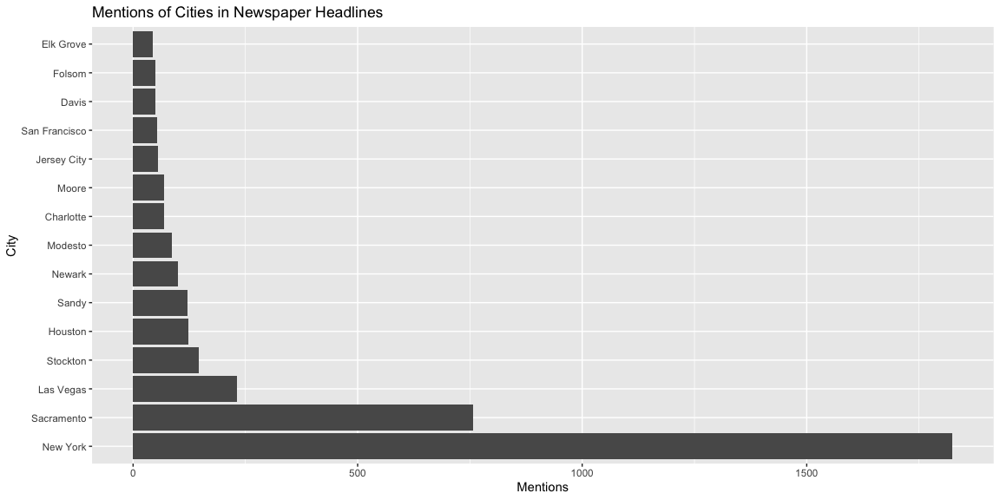
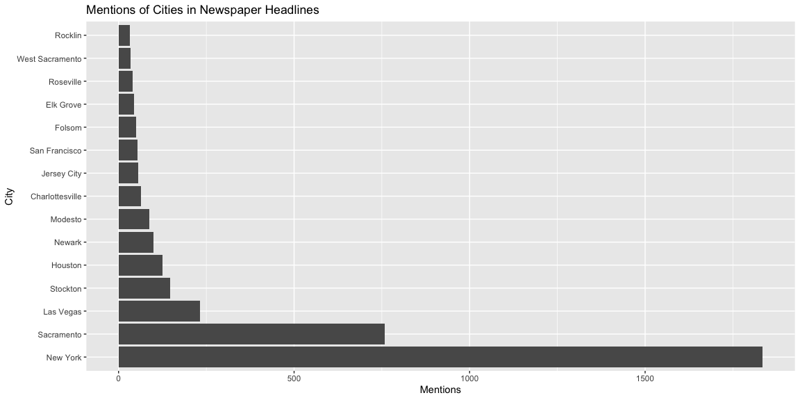
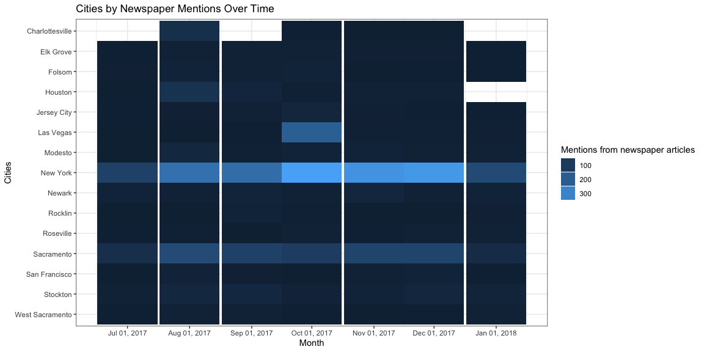
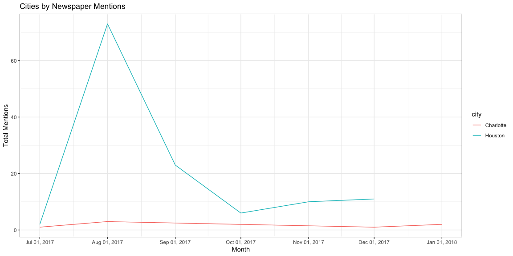

```r
library(tidyverse)
```

```
## ── Attaching packages ─────────────────────────────────────── tidyverse 1.3.1 ──
```

```
## ✔ ggplot2 3.3.5     ✔ purrr   0.3.4
## ✔ tibble  3.1.7     ✔ dplyr   1.0.9
## ✔ tidyr   1.2.0     ✔ stringr 1.4.0
## ✔ readr   2.1.2     ✔ forcats 0.5.1
```

```
## ── Conflicts ────────────────────────────────────────── tidyverse_conflicts() ──
## ✖ dplyr::filter() masks stats::filter()
## ✖ dplyr::lag()    masks stats::lag()
```

```r
#install.packages('maps')
library(maps)
```

```
## 
## Attaching package: 'maps'
```

```
## The following object is masked from 'package:purrr':
## 
##     map
```

```r
library(pander)
library(lubridate)
```

```
## 
## Attaching package: 'lubridate'
```

```
## The following objects are masked from 'package:base':
## 
##     date, intersect, setdiff, union
```

'''
1. How to filter out the non-city names
2. IDk why that last graph isn't working 
'''


```r
abc <- read_csv('https://storybench.org/reinventingtv/abc7ny.csv')
```

```
## Rows: 9745 Columns: 6
## ── Column specification ────────────────────────────────────────────────────────
## Delimiter: ","
## chr (6): datetime, headline, url, teaser, feed_name, feed_url
## 
## ℹ Use `spec()` to retrieve the full column specification for this data.
## ℹ Specify the column types or set `show_col_types = FALSE` to quiet this message.
```

```r
kcra <- read_csv('https://storybench.org/reinventingtv/kcra.csv')
```

```
## Rows: 13020 Columns: 6
## ── Column specification ────────────────────────────────────────────────────────
## Delimiter: ","
## chr (6): datetime, headline, url, teaser, feed_name, feed_url
## 
## ℹ Use `spec()` to retrieve the full column specification for this data.
## ℹ Specify the column types or set `show_col_types = FALSE` to quiet this message.
```

```r
master <- bind_rows(abc, kcra)
```
Question 1

```r
# create column without state abbreviation
city3 <- us.cities %>% mutate(city = str_sub(name, end=-4))

# create a long vector of strings and then append the boroughs at the end, collapase them all into one string
cities <- city3$city %>% append('the Bronx|Brooklyn|Manhattan|Queens|Staten Island|NYC') %>% 
  str_flatten(collapse = "|") 

master <- master %>% 
  mutate(city = str_extract(headline, pattern = cities))

master <- master %>% mutate(city = str_replace_all(master$city,  c('the Bronx'= 'New York', 'Brooklyn' = 'New York', 'Manhattan' = 'New York', 'Queens' = 'New York', 'Staten Island' = 'New York', 'NYC' = 'New York')))
```


```r
master %>%
  count(city) %>% na.omit() %>% arrange(-n) %>% head(15) %>% mutate(city = fct_reorder(city, desc(n))) %>% 
ggplot(aes(x = n, y = city)) +
  geom_col() +
  labs(x = 'Mentions', y = 'City', title='Mentions of Cities in Newspaper Headlines')
```

<!-- -->
Question 1, cleaned

```r
city3 <- city3 %>% 
  mutate(length = str_length(city)) %>% 
  arrange(desc(length))
  
cities2 <- city3$city %>%
  append('the Bronx|Brooklyn|Manhattan|Queens|Staten Island|NYC') %>% 
  str_flatten(collapse = "|") %>% 
  str_replace("Davis\\|",  "(?<!Viola )(?<!Dave )(?<!Kim )(?<!Paige )Davis") %>% 
  str_replace("Sandy\\|", "(?<!Superstorm )Sandy(?! Kenyon)(?! Hook)|") %>% 
  str_replace("Moore\\|", "(?<!Roy )(?<!Brian )(?<!Bud )(?<!Tyler )(?<!Mandy )Moore|") %>%  
  str_replace("Clinton\\|", "(?<!Bill )(?<!Hillary )(?<!Chelsea )Clinton(?! Foundation)[^s]|") %>%  
  str_replace_all("Columbus\\|", "(?<!Christopher )Columbus(?! statue(s?))(?! Day)(?! Circle)|") %>% 
  str_replace_all("Taylor\\|", "(?<!Will )Taylor(?! Swift)|") %>% 
  str_replace_all("Union\\|", "Union(?! Square)(?!dale)|") %>% 
  str_replace_all("Lincoln\\|", "Lincoln(?! Memorial)(?! Center)|") %>% 
  str_replace_all("\\|Charlotte\\|", "|Charlottesville|Charlotte|")

master2 <- master %>% 
  mutate(city = str_extract(headline, pattern = cities2))

master2 <- master2 %>% mutate(city = str_replace_all(master2$city,  c('the Bronx'= 'New York', 'Brooklyn' = 'New York', 'Manhattan' = 'New York', 'Queens' = 'New York', 'Staten Island' = 'New York', 'NYC' = 'New York')))
```


```r
master2 %>%
  count(city) %>% na.omit() %>% arrange(-n) %>% head(15) %>% mutate(city = fct_reorder(city, desc(n))) %>% 
ggplot(aes(x = n, y = city)) +
  geom_col() +
  labs(x = 'Mentions', y = 'City', title='Mentions of Cities in Newspaper Headlines')
```

<!-- -->
Our two graphs above illustrate the issue that may arise with textual data. In the first graph, we have the raw extraction of series of characters that match city names. One can quickly notice some peculiarities, however. It is strange that smaller towns like Sandy or Charlotte would appear so often. When taking a deeper look at the actual headlines, we see that, for Sandy, most of these are from names of people or a storm.  We then can use some regular expressions to denote specific cases of when to not count the names of Sandy and a few others, like Taylor and Clinton, as city names. If we also do a rearrangement based on length of names, then we fix the occurrence with Charlotte, since most of the accounts are actually from Charlottesville. Because Charlotte is inside of the word Charlottesville, the computer would stop parsing the word early thinking it had found the word Charlotte and having never continued on to find the full longer word. Our second graph reflects these changes. There are likely many more places in the dataset where this occurs, although it would take a very long time to make sure that it is 100% clean.

Question 2


```r
master2 <- master2 %>% mutate(date = str_sub(master$datetime, end=-12),
                  date = mdy(date))
```

```
## Warning: 5 failed to parse.
```

```r
tops <- master2 %>%
  count(city) %>% na.omit() %>% arrange(-n) %>% head(15) %>% mutate(city = fct_reorder(city, desc(n))) %>% .$city

master2 %>% 
  filter(city %in% tops) %>%
  mutate(url = 1) %>% 
  group_by(month = floor_date(date, "month"), city) %>% 
  summarize(total = sum(url)) %>%
  ggplot(aes(x = month, y = fct_relevel(city) %>%  fct_rev(), fill = total)) +
  geom_tile() +
  scale_x_date(date_labels = "%b %d, %Y", date_breaks = "1 month") +
  labs(x = "Month",
       y = "Cities",
       title = "Cities by Newspaper Mentions Over Time"
       ) + guides(fill = guide_legend(title = "Mentions from newspaper articles")) +
  theme_bw()
```

```
## `summarise()` has grouped output by 'month'. You can override using the
## `.groups` argument.
```

<!-- -->
From this graph it is apparent that New York and Sacramento are the most mentioned cities. For both of them, the beginning dates and ending dates of our dataset had the least amount of mentions. Other than that, there doesn't seem to be a huge trend over time that really stands out for any cities, other than singular months that suddenly pop. Las Vegas seems to be a hot topic in October, maybe because of Halloween. Houston must have had big event in August. I believe that may be when their baseball team, the Astros won the World Series.

Question 3

```r
master2 %>% 
  filter(city == 'Houston' | city == "Charlotte") %>%
  mutate(url = 1) %>% 
  group_by(month = floor_date(date, "month"), city) %>% 
  summarize(total = sum(url)) %>%
  ggplot(aes(x = month, y = total, color = city)) +
  geom_line() +
  scale_x_date(date_labels = "%b %d, %Y", date_breaks = "1 month") +
  labs(x = "Month",
       y = "Total Mentions",
       title = "Cities by Newspaper Mentions " 
       ) +
  theme_bw()
```

```
## `summarise()` has grouped output by 'month'. You can override using the
## `.groups` argument.
```

<!-- -->
It is very obvious that Houston is mentioned a lot more in the news than Charlotte. Charlotte wasn't even in the top 15 of our newspaper mentions after we did our proper data cleaning. 
